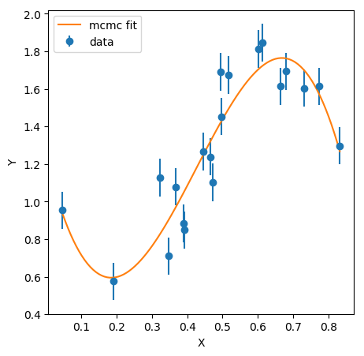

Escriba dentro en un archivo `Apellido_Nombre_fit_mcmc.cpp` el código necesario para 
estimar los parámetros de un polinomio de orden 3 que ajusta los datos
que se encuetran en `valores_x.txt` y `valores_y.txt`.

El código debe calcular las cadenas de markov correspondientes a los
cuatro parámetros tal como se hizo en el Taller 1.
Para facilitar el trabajo empiece la cadena de markov en `0` y de 
pasos del orden de `0.1` en el espacio de parámetros.
El código debe dar un millón de pasos.

El código debe tener una función `main()` como la que se muestra en el 
archivo `fit_mcmc_incompleto.cpp`:

```cpp
#include <fstream>
#include <iostream>
#include <string.h>
#include <stdlib.h>
#include <cmath>

using namespace std; 

float *read_file(string filename, int *n_points);
void model(float *y, float*x, int n_points, float *c, int poly_degree);
float loglikelihood(float *x_obs, float *y_obs, int n_points, float *c, int poly_degree);
float logprior(float *c, int poly_degree);
void MCMC_polynomial(float *x_obs, float *y_obs, int n_points, int n_steps, int poly_degree);

int main(){
  float *x=NULL;
  float *y=NULL;
  int n_x=0;
  int n_y=0;

  x = read_file("valores_x.txt", &n_x);
  y = read_file("valores_y.txt", &n_y);
  
  MCMC_polynomial(x, y, n_x, 1000000, 3);
  
  return 0;
}

```

Para calificar utilizaremos el archivo `fit_mcmc.py`.
Para verificar que su código funciona reemplaze la variable `filename` con el nombre de su archivo `cpp`.
Si todo sale bien debería tener una gráfica como la que se muestra aquí:


